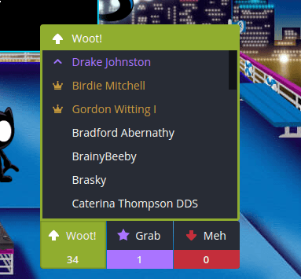

Vote Lists
==========

ExtPlug plugin that shows a list of users when hovering vote buttons.



## Installation

If you do not have ExtPlug yet, get it [here](https://extplug.github.io).

You can install this plugin by going to your ExtPlug settings menu, pressing
"Install Plugin", and entering this Plugin URL:

```
https://unpkg.com/extplug-vote-lists
```

## Alternative Designs

Several alternative [Stylish](https://userstyles.org/) userstyles for this
plugin can be found on the [Wiki](https://github.com/ExtPlug/vote-lists/wiki/Alternative-Designs).

## Building

**Note: this section is intended for developers only.**

First, install dependencies:

```bash
npm install
```

Then, use:

```bash
npm run build
```

The plugin will be built using the [ExtPlug CLI](https://github.com/extplug/extplug-cli).

The built plugin will be stored at `build/vote-lists.js`.

## License

[MIT](./LICENSE)
